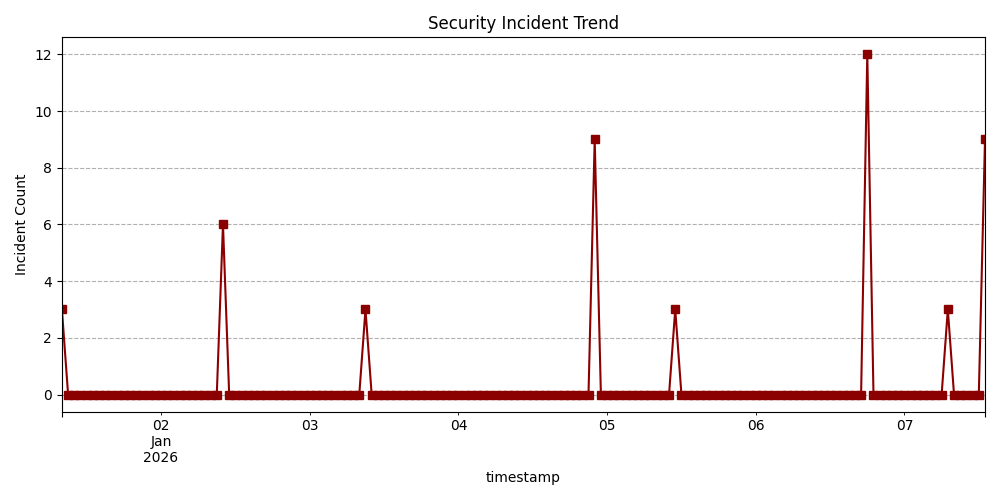

# 🔐 Security Log Analyzer

A Python-based security log analysis tool that detects suspicious activities such as failed login attempts, brute-force attacks, and access to restricted resources.  
The system stores detected incidents in a SQLite database, generates visual trend reports, and exports detailed results to Excel for further analysis.

---

## 📌 Project Overview

This project simulates a real-world **Security Operations Center (SOC)** automation task where system logs are analyzed to identify potential security threats.

It demonstrates practical Python skills in:
- Log parsing
- Threat detection
- Data processing
- Visualization
- Reporting

---

## 🚀 Key Features

- ✅ Detects multiple failed login attempts
- ✅ Identifies brute-force attacks within a defined time window
- ✅ Flags access to restricted URLs (e.g., `/admin`, `/config.php`)
- ✅ Stores security events in a SQLite database
- ✅ Generates a security incident trend visualization
- ✅ Exports detailed Excel reports for further investigation

---

## 🛠 Technologies Used

- **Python**
- **SQLite**
- **Pandas**
- **Matplotlib**
- **Requests**
- **JSON-based rule engine**

---

## 📊 Sample Output

### Security Incident Trend

The chart below visualizes detected security incidents over time, highlighting spikes caused by brute-force attacks and suspicious activity.



---

## ⚙️ How It Works

1. Reads system/server log files (`logs.txt`)
2. Applies detection rules defined in `rules.json`
3. Flags suspicious activity based on configurable thresholds
4. Enriches IP addresses with geo-location data
5. Stores events in a local SQLite database
6. Generates visual and Excel-based reports

---

## ▶️ How to Run

### 1️⃣ Install dependencies
```bash
pip install pandas matplotlib requests openpyxl
python SecurityLogAnalyzer.py --log logs.txt
